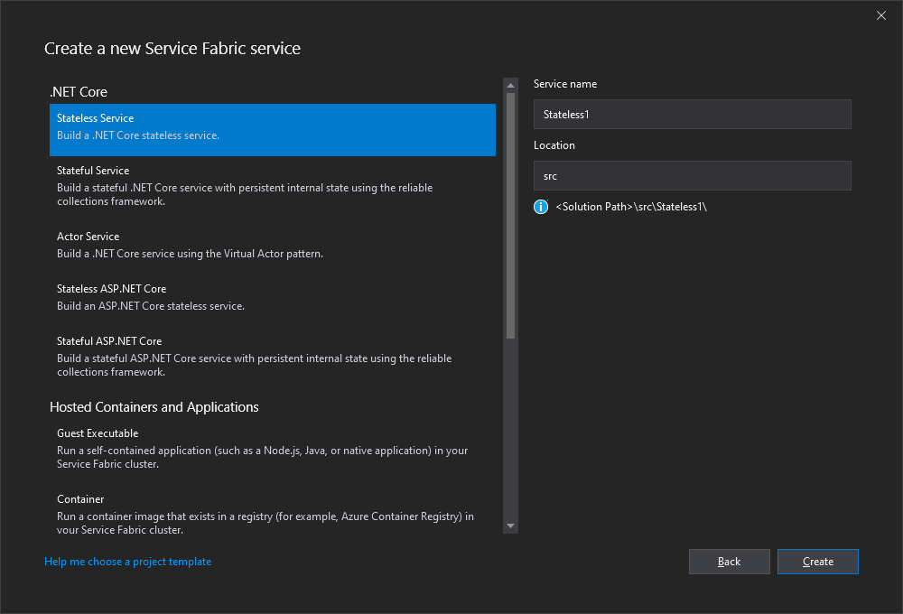
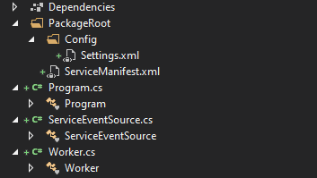

  

On Service fabric, you can either create ASP.NET Core API service or worker process. I'm going to create a worker service today

## Visual Studio Template Skeleton

Right click on ServiceFabric project &gt; Create a new Service Fabric service



Choose "Stateless Service" for worker service, as Stateful is the new evil in cloud era. It will create a skeleton service project. I named it xxxx.xxxx.xxxx.xxxx.Worker



You launch it by pressing "CTRL + F5" on Visual Studio. That's my favourite way of deploying the new service fabric into the local dev machine cluster.

## Shorten the default lengthy service name

You deploy it on to the cluster and notice that by default, the name of the service is pretty long. 

```text
fabric:/company.feature.service.type/company.feature.service.type.appName
```

Let's shorten it. Go to ServiceFabric project &gt; ApplicationPackageRoot &gt; Applicationmanifest.xml

Then shorten the name. 

First, remove all name spaces from service name

```markup
# Applicationmanifest.xml
<DefaultServices>
  <Service Name="Worker" ServicePackageActivationMode="ExclusiveProcess">
    <StatelessService ServiceTypeName="WorkerType" InstanceCount="[xxxx.xxxx.xxxx.xxxx.Worker_InstanceCount]">
      <SingletonPartition />
    </StatelessService>
  </Service>
</DefaultServices>
```

Secondly, shorten type name too for convenience

```markup
<!-- Applicationmanifest.xml -->
<DefaultServices>
  <Service Name="Worker" ServicePackageActivationMode="ExclusiveProcess">
    <StatelessService ServiceTypeName="WorkerType" InstanceCount="[xxxx.xxxx.xxxx.xxxx.Worker_InstanceCount]">
      <SingletonPartition />
    </StatelessService>
  </Service>
</DefaultServices>
```

```markup
<!-- ServiceManifest.xml -->
<ServiceTypes>
  <StatelessServiceType ServiceTypeName="WorkerType" />
</ServiceTypes>

```

```csharp
// Program.cs
private static void Main()
{
    try
    {
        ServiceRuntime.RegisterServiceAsync("WorkerType",
            context => new Worker(context)).GetAwaiter().GetResult();

```

## Install packages

Most of our apps uses Service Bus for messaging and Cosmos DB to store events.

The typical list of the packages are like these

```markup
<PackageReference Include="AspNetCore.HealthChecks.AzureServiceBus" Version="3.2.1" />
<PackageReference Include="Microsoft.ApplicationInsights.WorkerService" Version="2.14.0" />
<PackageReference Include="Microsoft.Azure.Cosmos" Version="3.9.1" />
<PackageReference Include="Microsoft.Azure.Management.ServiceBus" Version="2.1.0" />
<PackageReference Include="Microsoft.Extensions.Configuration.EnvironmentVariables" Version="3.1.4" />
<PackageReference Include="Microsoft.Extensions.Configuration.Json" Version="3.1.4" />
<PackageReference Include="Microsoft.Extensions.DependencyInjection" Version="3.1.4" />
<PackageReference Include="Microsoft.Extensions.Hosting" Version="3.1.4" />
<PackageReference Include="Microsoft.Extensions.Logging" Version="3.1.4" />
<PackageReference Include="Microsoft.Extensions.Logging.Abstractions" Version="3.1.4" />
<PackageReference Include="Microsoft.Extensions.Logging.Console" Version="3.1.4" />
<PackageReference Include="Microsoft.ServiceFabric.Services" Version="3.4.658" />

```

## Add a generic host

A "host" is an object that encapsulates an app's resources, such as:

* Dependency injection \(DI\)
* Logging
* Configuration
* IHostedService implementation

\(from [https://docs.microsoft.com/en-us/aspnet/core/fundamentals/host/generic-host?view=aspnetcore-3.1](https://docs.microsoft.com/en-us/aspnet/core/fundamentals/host/generic-host?view=aspnetcore-3.1)\)

It is typicallyed configured, built, and run by code in the Program class. In service fabric worker service, it'll be configured by a Stateless service. The flow is like this

1. Program register a stateless service. In my case, "WorkerType"
2. "Worker" class build a host and configure 
   1. App Configuration
   2. Services
   3. Logging
3. then "Worker" class start the host
4. "EventSubscriptionHostedService" starts and subscribe to Service Bus messages

```csharp
// Worker.cs
internal sealed class Worker : StatelessService
{
    private IHost _host;
    private readonly IHostBuilder _hostBuilder;

    public Worker(StatelessServiceContext context)
        : base(context)
    {
        var builder = new HostBuilder();
        builder.ConfigureAppConfiguration(ServiceRegistrations.ConfigureAppConfiguration);
        builder.ConfigureServices(ServiceRegistrations.ConfigureServices);
        builder.ConfigureLogging(ServiceRegistrations.ConfigureLogging)
            ;
        _hostBuilder = builder;
    }


    protected override async Task OnOpenAsync(CancellationToken cancellationToken)
    {
        _host = _hostBuilder.Build();
        await _host.StartAsync(cancellationToken);
    }

    protected override async Task OnCloseAsync(CancellationToken cancellationToken)
    {
        if (_host != null)
        {
            await _host.StopAsync(cancellationToken);
            _host.Dispose();
        }
    }

    protected override void OnAbort()
    {
        _host?.StopAsync().GetAwaiter().GetResult();
        _host?.Dispose();
    }

    ....
}
```

```csharp
// ServiceRegistrations.cs
public class ServiceRegistrations
{
    public static void ConfigureAppConfiguration(IConfigurationBuilder configurationBuilder)
    {
        configurationBuilder.AddJsonFile("appsettings.json", optional: false, reloadOnChange: true);
#if DEBUG
        configurationBuilder.AddJsonFile($"appsettings.Development.json", true);
        configurationBuilder.AddEnvironmentVariables("DEVELOPMENT_");
#endif

    }

    public static void ConfigureServices(HostBuilderContext context,
        IServiceCollection services)
    {
        var configuration = context.Configuration;
        services
            .AddOptions()
            .Configure<ServiceBusOptions>(configuration.GetSection("ServiceBus"));

        services.AddTransient<IEnumerable<IHealthCheck>>(sp => new List<IHealthCheck>());
        services.AddApplicationInsightsTelemetryWorkerService();
        services.AddHostedService<DispatchEventHostedService>();
    }

    public static void ConfigureLogging(HostBuilderContext ctx, ILoggingBuilder lb)
    {
        lb.AddFilter<ApplicationInsightsLoggerProvider>("", LogLevel.Information);
    }
}
```

```csharp
// HostedService
public class EventHostedService : IHostedService
{
    private readonly ILogger<EventHostedService> _logger;
    private readonly TelemetryClient _telemetryClient;

    public DispatchEventHostedService(ILogger<DispatchEventHostedService> logger)
    {
        _logger = logger;
    }

    public async Task StartAsync(CancellationToken cancellationToken)
    {
        _logger.LogInformation($"{GetType().Name} has started");
        _logger.LogWarning("Test Test");
    }

    public Task StopAsync(CancellationToken cancellationToken)
    {
    }
}

```


