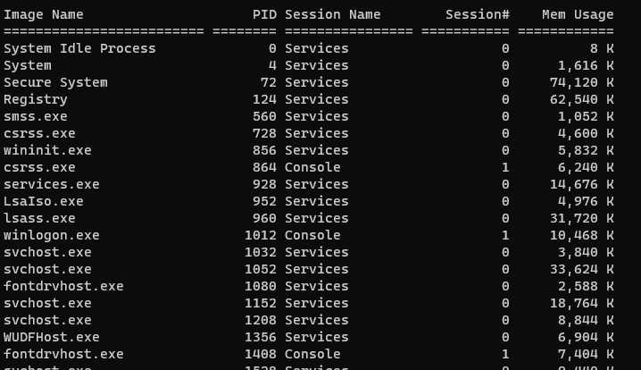

  

When I run a unit test, sometimes the spawned process doesn't go away but holds the assembly files. The other day, a process, "testhost", was running. It wasn't visible on Task Manager UI. So I had to kill it using CLI.

* Open the powershell prompt. I use [Windows Terminal](https://devblogs.microsoft.com/commandline/introducing-windows-terminal/)
* Type tasklist to see the list of all running processes and their PIDs. You can use a pipe with the more command



* To kill a process by its PID, type like the below

```text
taskkill /F /PID pid_number
```

* To kill a process by its name, type the command

```text
taskkill /IM "process name" /F
```

You can use PowerShell commands too

```text
Stop-Process -Name "Process Name" -Force
Stop-Process -ID PID -Force
```

