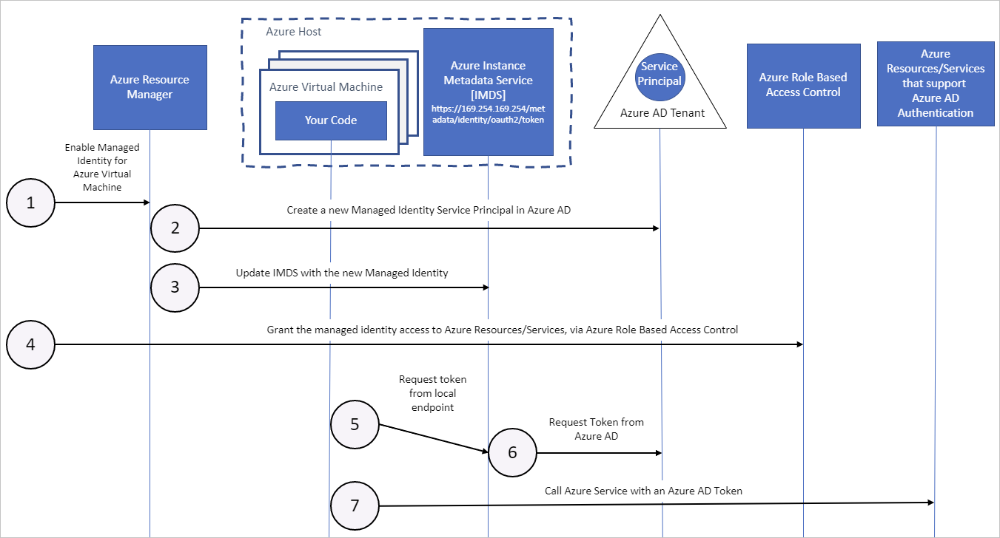

  

A common challenge when building cloud applications is how to manage the credentials in your code for authenticating to cloud services. Keeping the credentials secure is an important task. Ideally, the credentials never appear on developer workstations and aren't checked into source control. Azure Key Vault provides a way to securely store credentials, secrets, and other keys, but your code has to authenticate to Key Vault to retrieve them.

The managed identities for Azure resources feature in Azure Active Directory \(Azure AD\) solves this problem. The feature provides Azure services with an automatically managed identity in Azure AD. You can use the identity to authenticate to any service that supports Azure AD authentication, including Key Vault, without any credentials in your code.

### Terms

* Client ID: a unique id generated by Azure AD that's tied to an application and service principal
* Principal ID: the id of th eservice principal object for the managed identity. This is used to grant role-based access to an Azure resource
* Azure Instance metadata Service \(IMDS\): a REST endpoint to all laaS VMs

### Two types of identity

* system-assigned identity: tied to service 
* user-assigned identity: multiple services can share

This is the diagram that shows how managed identities work with Azure VMs.

